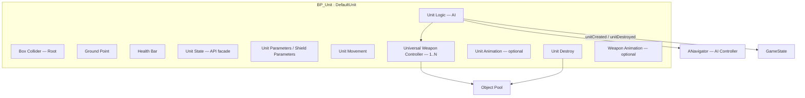
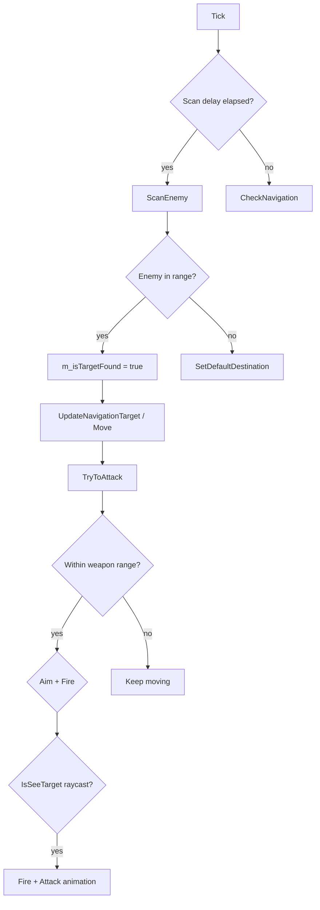

# Atom Destiny Units — Architecture and Creation

General overview of the unit system: components, parameters, AI, navigation, and how to add a new unit to the project.

For specific units (Shooter, Lancer, Hunter) and their current balance, see [CurrentUnits.md](./CurrentUnits.md).

---

## 1. Overall Architecture

A combat unit is a **Blueprint Pawn** derived from the C++ class **`ADefaultUnit`**. Gameplay logic (AI, damage, navigation, object pooling) lives in C++. Blueprints define visuals, numeric parameters, weapons, projectiles, and VFX.



### Layer Responsibilities

| Layer | Location | Responsibility |
|-------|----------|----------------|
| Pawn / visuals | Blueprint | Meshes, collider, fire points, VFX references |
| Unit Logic | C++ (`UUnitLogic`) | Enemy search, navigation, attack, animation states |
| Unit State | C++ (`UUnitState`) | Single access point for HP, weapons, shield, speed |
| Weapon | C++ (`UUniversalWeaponController`) | Raycast, projectile and VFX spawn |
| Projectile | Blueprint + C++ base | Damage via GameState |
| GameState | C++ | Per-side unit registry, damage calculation |

### Combat Lifecycle

1. **`UUnitLogic`** periodically scans for enemies, moves the unit via **`ANavigator`**, and rotates the body toward the target.
2. Within attack range it calls **`Fire()`** on every component implementing **`IWeapon`**.
3. **`UUniversalWeaponController`** spawns the projectile and particle; **the projectile** deals damage, not the VFX.
4. When HP ≤ 0, **`UUnitParameters`** calls **`IDestroyable::Destroy()`** → explosion / scrap via **`UUnitScrapDestroy`**.

---

## 2. Required Components

`ADefaultUnit` creates the base set automatically:

| Component | C++ class | Purpose |
|-----------|-----------|---------|
| Box collider | `UBoxComponent` | Root, collision |
| Ground point | `USceneComponent` | Aim point for enemy projectiles |
| Health bar | `UHealthBarComponent` | HP widget above the unit |
| Unit state | `UUnitState` | Unit API for UI and gameplay |
| Unit logic | `UUnitLogic` | AI |
| Unit parameters | `UUnitParameters` | HP and defence |
| Unit movement | `UUnitMovementComponent` | Pawn movement |
| Unit destroy | `UUnitScrapDestroy` | Death (can be replaced with `UUnitBasicDestroy`) |

Additional Blueprint components:

- **`UUniversalWeaponController`** — one or more weapons
- **`UUnitAnimationBase`** — walk / attack animation when needed
- **`UWeaponAnimationBase`** — separate weapon animation when needed
- **`UUnitShieldParameters`** — replaces `UUnitParameters` when a shield is required

### Runtime Requirements

**`UUnitState::BeginPlay`** validates:

- **Ground point** is assigned
- A component implementing **`ILogic`** exists
- A component implementing **`IParameters`** exists

**`UUnitLogicBase::BeginPlay`** requires:

- **`AIControllerClass = ANavigator`**
- A working **`UUnitMovementComponent`** on the Pawn

### Auto-Discovery

Components are **not wired manually** — logic finds them on the actor by interface:

- **`IWeapon`** — all weapons (`GetInterfaces<IWeapon>`)
- **`IAnimation`** — unit animation
- **`IWeaponAnimation`** — weapon animation
- **`IShield`** — shield (if present)

---

## 3. Movement

### Navigator + FloatingPawnMovement

The unit is driven by **`ANavigator`** (AI Controller). On **`BeginPlay`**, logic:

1. Obtains Navigator from `Pawn->Controller`.
2. Binds **`UUnitMovementComponent`** (`UFloatingPawnMovement`) to it.
3. Uses **`MaxSpeed`** as the base speed.

Navigator uses **NavMesh** and **Crowd Following** for pathfinding.

### Body Rotation

**`UUnitMovementComponent`** rotates the Pawn each tick along **velocity** (**`Rotation speed`**, default 5).

When the unit stands still and only turns to attack, **`UUnitLogicBase::RotateToTarget`** handles rotation (**`Rotate speed`** on Unit Logic).

### Speed and Modifiers

- Base speed comes from Navigator / movement component.
- Speed buffs use **`EObjectParameters::Velocity`** on Unit Logic (`UUnitState::AddParameter`).
- With **`Stop when attack`**, Navigator stops while aiming.

### Behaviour Modes (`EUnitBehaviour`)

Set via **`SetDestination`** / **`SetDestinationByPoint`**:

| Mode | Behaviour |
|------|-----------|
| `MoveToTransform` | Move toward a target actor (destination from GameState) |
| `MoveToPoint` | Move toward a world point |
| `Standing` | Hold position but attack enemies in range |

If no destination is set, the unit finds the **nearest enemy** and moves toward it.

---

## 4. Enemy Search and Attack

### Algorithm (each `UUnitLogic` tick)



### Scan Radii

Computed from **all** weapons (`CalculateDistances`):

| Parameter | Formula / source |
|-----------|------------------|
| **Scan distance** | max(`Attack range`) + `Attack delta range` |
| **Min scan distance** | min(`Minimal distance to shot`) |

**`Scan delay`** (default 0.125 s) plus a random offset of 0.02–0.18 s between searches.

### Target Selection

`FindEnemy(minScan, maxScan)`:

1. Reads the enemy list from **GameState** for the unit's side.
2. Filters by squared distance: `minScan² ≤ dist² ≤ maxScan²`.
3. Picks the **closest** match.

### Attack

For each weapon:

1. **`SetTarget(enemy)`**
2. If distance ≤ `attackRange² + tryAttackDelta` and **`IsSeeTarget()`** (raycast when enabled):
   - if **rotated weapon** — rotate **`Weapon component`**; otherwise rotate the body
   - **`Fire(deltaTime)`**
3. If **`Stop when attack`** — Navigator.Stop + Attack animation.

---

## 5. Unit Parameters

### 5.1. Unit Parameters (`UUnitParameters`)

| Parameter (Editor) | C++ field | Default | Description |
|--------------------|-----------|---------|-------------|
| Max health | `m_maxHealth` | 10 | Maximum HP |
| Defence | `m_defence` | 0 | Flat subtraction before armour type |
| Defence type | `m_defenceType` | Medium | Light / Medium / Heavy |
| Balance parameters | `m_balanceParameters` | 0 | % resist Ballistic / Energy / Explosive / Elemental |
| Hide bar | `m_hideBar` | false | Hide HP bar at full health |

**Damage formula:** `max(rawDamage - defence, MinDamage)` → armour type multiplier → % resists.

### 5.2. Unit Shield Parameters (`UUnitShieldParameters`) — optional

| Parameter | Default | Description |
|-----------|---------|-------------|
| Max shield value | 100 | Shield capacity |
| Shield absorbation | 0 | Flat absorption |
| Shield regeneration value | 0.5 | Regen per tick |
| Shield regeneration cool dawn | 0.1 | Cooldown between regen ticks |
| Shield type | Electrical | Electrical / Plasmas |
| Shield balance parameters | — | % weapon-type resists for shield |

### 5.3. Unit Logic (`UUnitLogicBase`)

| Parameter | Default | Description |
|-----------|---------|-------------|
| Game side | Rebels | Rebels / Federation / Neutral |
| Unit type | None | **`EADUnitType`** — required for registration |
| Unit size | None | Small / Medium / Huge (energy, deathmatch) |
| Unit cost | 1 | Mineral cost |
| Attack delta range | 5 | Extra range added to max weapon range for scanning |
| Attack angle | 5 | Body-to-target angle tolerance (°) |
| Default stop distance | 50 | Navigator stop distance |
| Try attack delta | 1.2 | Firing range tolerance |
| Rotate speed | 2 | Body rotation speed |
| Scan delay | 0.125 | Interval between enemy scans |

### 5.4. Unit Movement

| Parameter | Default | Description |
|-----------|---------|-------------|
| Rotation speed | 5 | Model rotation along movement direction |
| Max speed | (movement) | Pawn speed (from FloatingPawnMovement) |

### 5.5. Weapon — base (`UWeaponBase`)

| Parameter | Default | Description |
|-----------|---------|-------------|
| Damage | 2 | Base damage |
| Attack range | 5 | Range |
| Reload time | 2 | Reload after a burst |
| Critical chance | 15 | Crit chance (%) |
| Critical rate | 2 | Crit damage multiplier |
| Explosion radius | 1 | > 0 → AOE |
| Weapon type | Ballistic | Ballistic / Energy / Explosive / Elemental |
| Rotated weapon | false | Weapon rotates toward target independently |
| Stop when attack | true | Stop the unit while attacking |
| Use raycast | true | Line-of-sight check before firing |
| Use friendly fire | true | Raycast passes through allies |
| Minimal distance to shot | 0 | Dead zone (minimum range) |
| Weapon component | — | SceneComponent for turret rotation |
| Projectile prefab | — | Projectile class (`AProjectileBase`) |
| Layer mask to ignore | — | Raycast collision channel |

### 5.6. Universal Weapon Controller

| Parameter | Default | Description |
|-----------|---------|-------------|
| Ammunition count | 1 | Shots per magazine |
| Ammunition shot delay | 1.5 | Delay between shots in a magazine |
| Delay between position shots | 0 | Delay between fire points |
| Shooting position | — | **Required** — array of SceneComponents |
| Scan position | — | Raycast origin (optional) |
| Shot particle prefab | — | Muzzle VFX |

### 5.7. Unit Destroy

**`UUnitScrapDestroy`:**

| Parameter | Default | Description |
|-----------|---------|-------------|
| Explosion particle prefab | — | Explosion VFX |
| Scrap prefab | — | Physics debris |
| Min / max explosion power | 1000 / 3000 | Impulse applied to debris |
| Explosion radius | 125 | Impulse radius |
| Parts destroy time | 1.5 | Debris lifetime |

### 5.8. Modifiers (buffs / debuffs)

Via **`UUnitState::AddParameter`** (`EObjectParameters`):

| Parameter | Applied to |
|-----------|------------|
| Damage, Range, Reload, CriticalRate, CriticalChance, ExplosionRadius | All weapons |
| Velocity | Unit Logic |
| MaxHealth, Health, Defence | Parameters / Shield |
| MaxShield, Shield, Absorption | Shield |

---

## 6. Projectiles

Base C++ classes live in `Source/AtomDestiny/Projectile/`:

| Class | Purpose |
|-------|---------|
| `AProjectileBase` | Abstract base, impact prefab |
| `AInvisibleProjectile` | Hitscan: delay → damage + impact VFX |
| `ALaserProjectile` | Beam (Niagara), timed damage |
| `ARocketBase` / `AAimRocket` | Homing rocket |

Blueprint projectiles **must** inherit one of these classes and provide an **Impact prefab** where applicable.

---

## 7. Animation

### Unit (`IAnimation` → `UUnitAnimationBase`)

- Automatically finds the first **`USkeletalMeshComponent`** on the actor.
- **`Idle()`**, **`Walk()`**, **`Attack()`** are called from Unit Logic.
- For custom behaviour, add a C++ class under `Source/AtomDestiny/Unit/<Name>/`.

### Weapon (`IWeaponAnimation` → `UWeaponAnimationBase`)

- Set **Skeletal mesh with animation**.
- **`IsReady()`** / **`Animate()`** — weapon does not fire until the animation is ready.

### Animation Blueprint

Create next to the unit BP: `Content/Blueprint/Units/<Name>/ABP_<Name>.uasset`.

---

## 8. Adding a New Unit

### 8.1. Content Layout

```
Content/
├── Models/Units/<UnitName>/
│   ├── Meshes/          ← Static Mesh (SM_*) or Skeletal (SK_*, SKM_*)
│   ├── Materials/       ← M_<UnitName>
│   ├── Textures/        ← T_<UnitName>_D, _N, …
│   └── Animations/      ← A_* (for skeletal units)
│
├── Blueprint/Units/<UnitName>/
│   ├── BP_<UnitName>.uasset           ← main prefab (parent: DefaultUnit)
│   ├── ABP_<UnitName>.uasset          ← AnimBP (if needed)
│   ├── BP_<UnitName>Projectile*.uasset
│   └── BP_*Particle*.uasset           ← shot / impact VFX
│
└── Blueprint/Particles/               ← shared VFX (optional)
```

**Naming:** PascalCase with UE prefixes — `SM_`, `SK_`, `M_`, `T_`, `BP_`, `ABP_`.

### 8.2. C++ Code (when needed)

| Task | Location |
|------|----------|
| New menu / logic type | `Source/AtomDestiny/Unit/Unit.h` → **`EADUnitType`** |
| Custom unit animation | `Source/AtomDestiny/Unit/<UnitName>/` |
| Custom weapon animation | `Source/AtomDestiny/Unit/<UnitName>/` or `Weapon/` |
| New projectile type | `Source/AtomDestiny/Projectile/` |
| New weapon type (rare) | `Source/AtomDestiny/Weapon/` |

Most units only need a Blueprint based on **`DefaultUnit`** + **`UniversalWeaponController`** with no new C++.

### 8.3. Editor Steps

1. Import meshes / textures into `Content/Models/Units/<UnitName>/`.
2. **Create Blueprint → Parent: `DefaultUnit`** in `Content/Blueprint/Units/<UnitName>/`.
3. Build the mesh hierarchy; configure **Box Collider** and **Ground Point**.
4. Add **`UniversalWeaponController`**, set **Shooting position**, **Projectile prefab**, **Shot particle**.
5. Create a projectile Blueprint from `AInvisibleProjectile` / `AAimRocket` / etc.
6. Configure **Unit Logic** (side, type, size, cost) and **Unit Parameters** (HP, defence).
7. Configure **Unit Scrap Destroy** (explosion + scrap prefab).
8. Verify **AI Controller Class = Navigator**.

### 8.4. In-Game Registration

1. Add a value to **`EADUnitType`** in `Unit.h` (before `None`).
2. **`AAtomDestinyStartMenuGameState`** → **`m_units`**: add prefab and color (`FUnitInfo`).
3. On combat maps — **GameState** with **Game destination** (player / enemy destination actors).
4. **NavMesh** must cover the play area.

---

## 9. Checklist

- [ ] Parent class = **DefaultUnit**
- [ ] **AIControllerClass** = **Navigator**
- [ ] **Ground Point** is set
- [ ] **Unit type** ≠ None
- [ ] **Unit Parameters** (or Shield) present
- [ ] **Unit Destroy** with explosion prefab
- [ ] Weapon: **Shooting position** + **Projectile prefab**
- [ ] Projectile: **Impact prefab**
- [ ] Type in **`EADUnitType`** and **`StartMenuGameState`**
- [ ] NavMesh on the map

---

## 10. Common Issues

| Symptom | Cause |
|---------|-------|
| Unit does not move | AI Controller ≠ Navigator |
| Does not fire | Missing shooting positions / projectile / raycast blocked |
| Rotated weapon does not fire | Weapon component not set / weapon animation not ready |
| BeginPlay crash | Missing ground point / logic / parameters |
| No damage | Projectile does not inherit `AProjectileBase` / no impact logic |
| Missing from menu | Not added to `m_units` |
| Unit type = None | Not set on Unit Logic |

---

## 11. Key Source Files

| Path | Contents |
|------|----------|
| `Source/AtomDestiny/Templates/DefaultUnit.*` | Base Pawn |
| `Source/AtomDestiny/Logic/UnitLogic*.` | AI, enemy search, attack |
| `Source/AtomDestiny/Navigation/Navigator.*` | NavMesh movement |
| `Source/AtomDestiny/Weapon/UniversalWeaponController.*` | Weapons |
| `Source/AtomDestiny/Unit/Unit.h` | `EADUnitType`, `EUnitSize`, `EUnitBehaviour` |
| `Source/AtomDestiny/Gameplay/UnitInfo.h` | Prefab registration |
| `Source/AtomDestiny/AtomDestinyGameStateBase.*` | Unit registry, damage |
